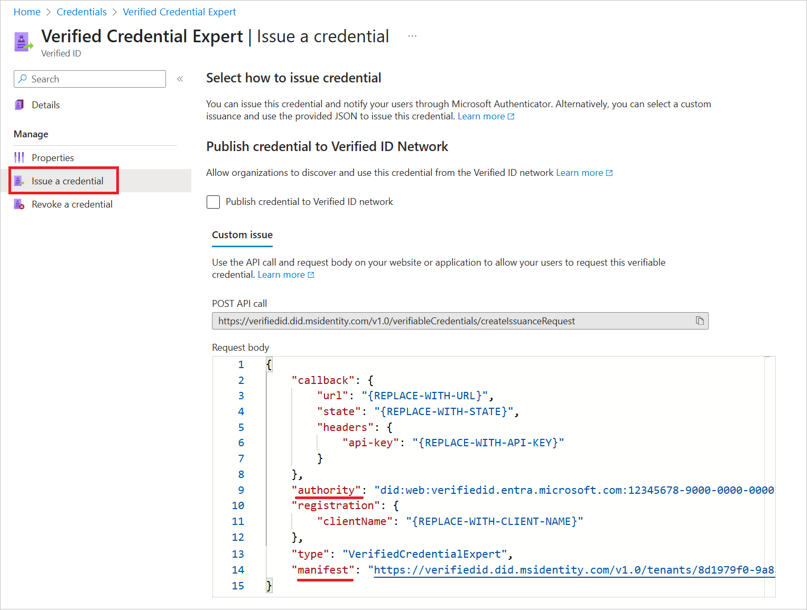
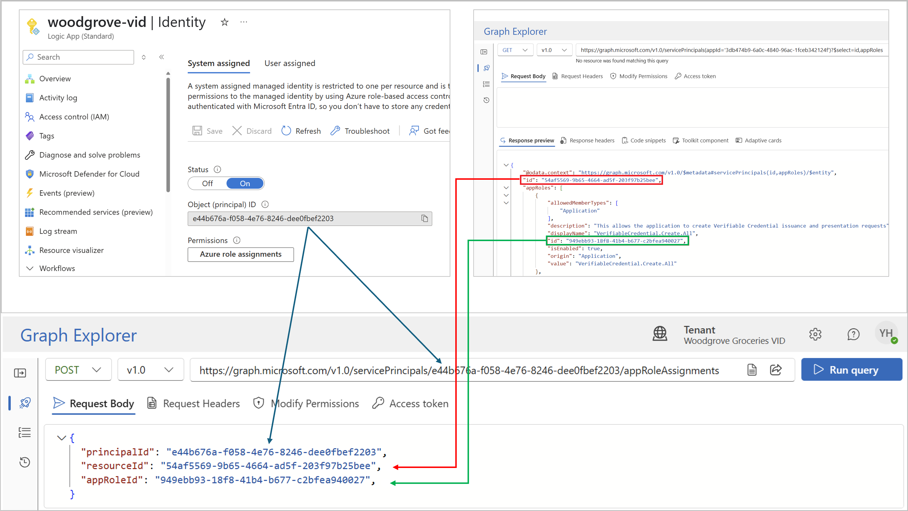
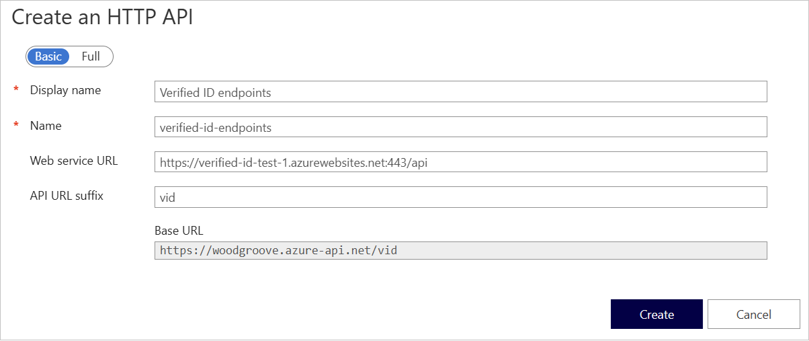
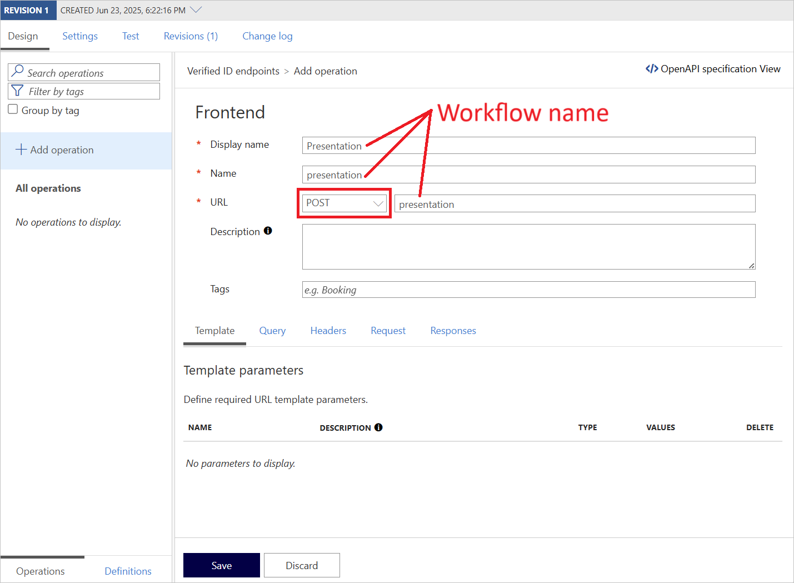
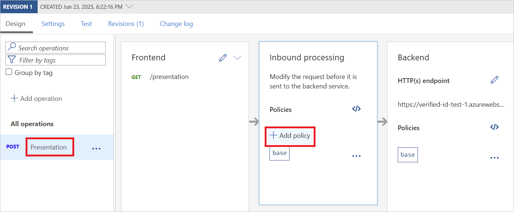
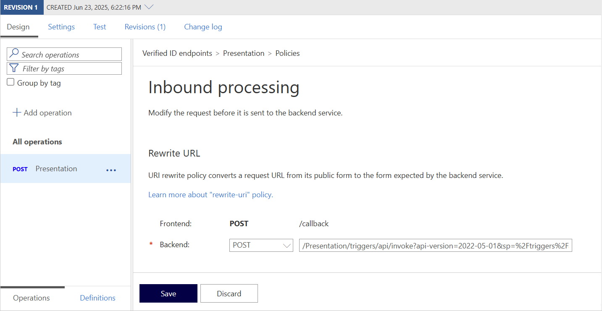
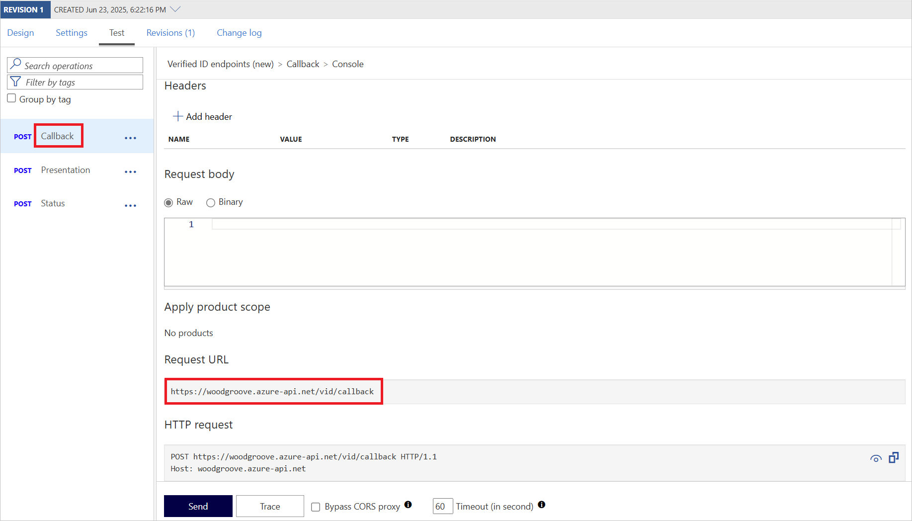
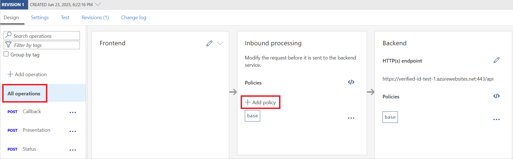
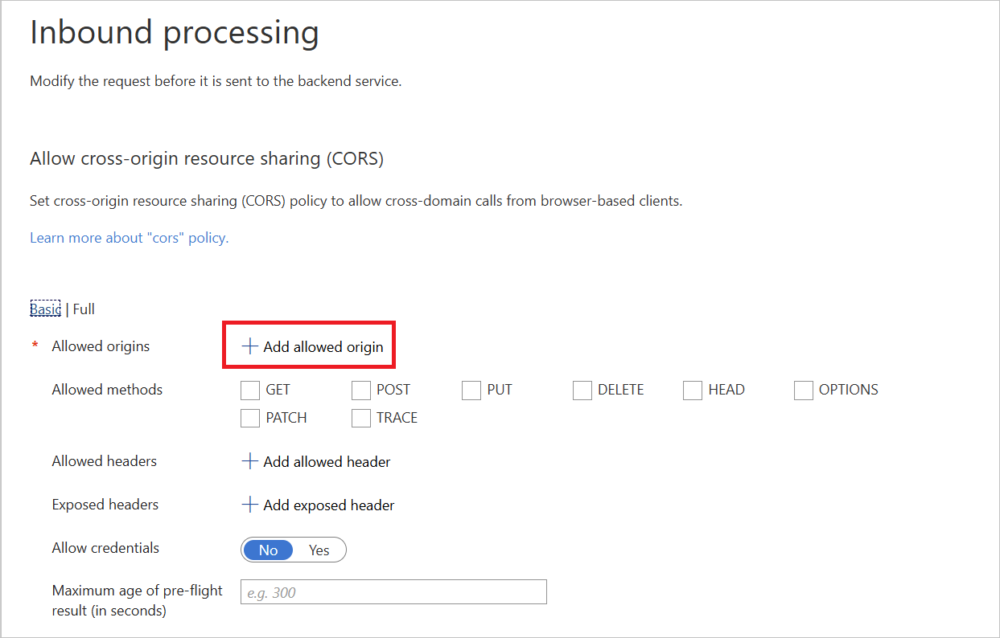
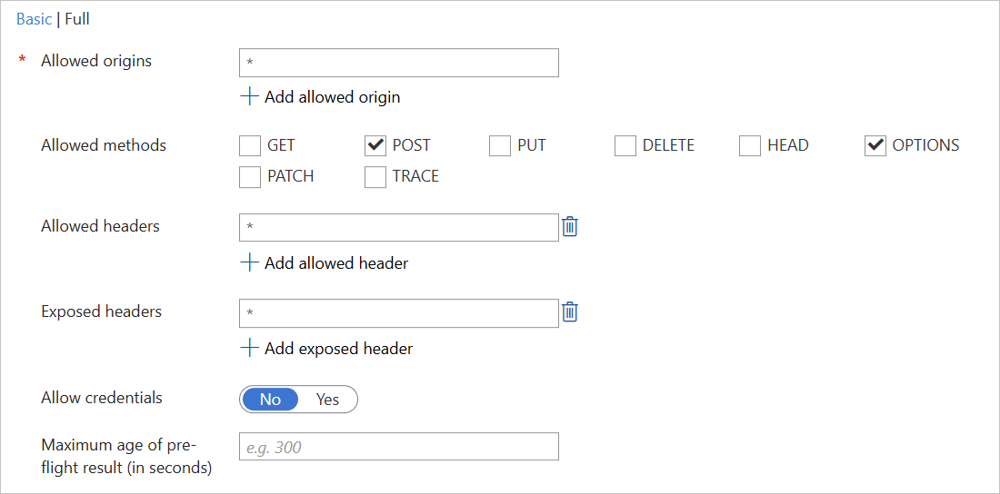

# Verified ID low-code solution

Follow the steps in this article to deploy the Microsoft Entra verified ID solution. For the solution overview, please read the [overview document](Overview.md).

## 1. Prepare your environment

Start by setting up your Microsoft Entra verified ID service using either the [quick](https://learn.microsoft.com/en-us/entra/verified-id/verifiable-credentials-configure-tenant-quick) or [advanced](https://learn.microsoft.com/en-us/entra/verified-id/verifiable-credentials-configure-tenant) setup. 

### 1.1 Create verified ID credential

1. Navigate to <https://entra.microsoft.com> and sign-in with your admin account.
1. From the menu, under **verified ID**, select **credentials**.
1. Select **Add credential**, then select the **Custom credential** option, and  select **Next**.
1. On the **Create a new credential** page:
    1. Enter a **display name**, like `VerifiedCredentialExpert`.
    1. Enter the following **display definitions**.

    ```json
    {
      "locale": "en-US",
      "card": {
        "backgroundColor": "#730073",
        "description": "Use your verified credential to prove to anyone that you know all about verifiable credentials.",
        "issuedBy": "Woodgrove",
        "textColor": "#ffffff",
        "title": "Verified Credential Expert",
        "logo": {
          "description": "Verified Credential Expert Logo",
          "uri": "https://woodgrovedemo.com/images/logo.png"
        }
      },
      "consent": {
        "instructions": "Sign in with your account to get your card.",
        "title": "Do you want to get your Verified Credential?"
      },
      "claims": [
        {
          "claim": "vc.credentialSubject.displayName",
          "label": "Display name",
          "type": "String"
        },
        {
          "claim": "vc.credentialSubject.photo",
          "label": "Photo",
          "type": "image/jpg;base64url"
        }
      ]
    }
    ```

    1. Enter the following **Rules definition**:

    ```json
    {
      "attestations": {
        "idTokenHints": [
          {
            "mapping": [
              {
                "outputClaim": "displayName",
                "required": true,
                "inputClaim": "displayName",
                "indexed": true
              },
              {
                "outputClaim": "photo",
                "required": false,
                "inputClaim": "photo",
                "indexed": false
              }
            ],
            "required": false
          }
        ]
      },
      "validityInterval": 2592000,
      "vc": {
        "type": [
          "VerifiedCredentialExpert"
        ]
      }
    }
    ```

    1. Finally, select **Create**.
1. Select the credential you created.
1. From the menu, select **Issue a credential**.
1. In the **request body** JSON
    1. Copy the value of the **authority** ID. It's your Decentralized Identifier.
    1. Copy the value of the **manifest** URL. It's the manifest URL of the verified ID credential.

    
    

## 2. Create Azure Logic app service

1. Go to <https://portal.azure.com> and sign in with your admin account.
1. Search and select **Logic apps**.
1. On the Logic apps page, select **Add**.
1. Select one of the **Standard hosting** options.
1. On the **Basics** tab:
    1. Select your **Azure subscription**.
    2. Select a **Resource group** where the logic app and its related resources will be created. You can also create a new one.
1. Enter a **Name** for your logic app. This name must be globally unique.
1. Choose a **Region** for your logic app.
1. Then a **Service plan** that defines a set of compute resources for the Logic App to run. 
1. Finally, select the **pricing plan**. This choice can be changed later. 
1. More settings are available to you. However, you can leave the default settings and select **review and create**.
1. After Azure validates your logic app setting, select **create**.
1. On the deployment completion page, you can select **Go to resource**. Or select the logic app from the search box.

## 3. Grant Managed Identity access to Verified ID Service

[Managed identity](https://learn.microsoft.com/en-us/entra/identity/managed-identities-azure-resources/overview) in Entra ID enables Azure services, such as Logic App, to other services without storing credentials in your app. It simplifies access control by automatically managing identity credentials for apps and services. This process involves granting the Azure Logic app access to the Microsoft Entra Verified ID request service.

1. Start by getting the Logic App system managed identity.
    1. In the Azure Logic, under  **Settings**, select **Identity**
    1. In the **system identity** tab, make sure the **Status** is **On**.
    1. Copy the **Object (principal) ID**.
1. Next, find the service principal of the **Verifiable Credentials Service Request** service.
    1. Open Graph Explorer at <https://aka.ms/ge>
    1. Sign-in with your admin account. Make sure you have the permissions as listed [here](https://learn.microsoft.com/en-us/graph/api/serviceprincipal-get).
    1. Run the following GET query. The [query](https://learn.microsoft.com/en-us/graph/api/serviceprincipal-get) searches for a service principal with the application ID `3db474b9-6a0c-4840-96ac-1fceb342124f`. This is a constant value across all Microsoft Entra ID tenants. The query will return the service principal ID and the application roles.

    ```http
    https://graph.microsoft.com/v1.0/servicePrincipals(appId='3db474b9-6a0c-4840-96ac-1fceb342124f')?$select=id,appRoles
    ```
    
    1. From the **response** JSON, copy the value of the `id`. This ID uniquely identifies a local representation of the `Verifiable Credentials Service Request` application within your tenant. In the next step, it will be referred to as **{resourceId}**.

    1. Locate the **application role** with the value `VerifiableCredential.Create.All` and record its ID.  In the next step, it will be referred to as **{appRoleId}**.

1. Finally, grant the Logic App managed identity permission to the **Verifiable Credentials Service Request** service.
    1. Set the HTTP method to **POST**.
    1. Set the URL query to the following and replace the **{principalId}** with the Azure Logic App Managed Identity service principal.

    ```http
    https://graph.microsoft.com/v1.0/servicePrincipals/{principalId}/appRoleAssignments
    ```
    
    1. In the body enter the following JSON.

    ```json
    {
      "principalId": "{principalId}",
      "resourceId": "{resourceId}",   
      "appRoleId": "{appRoleId}",
    }
    ```

    Replace:
    - **{principalId}** with the Azure Logic App managed identity service principal. It should be the one that appears in the URL.
    - **{resourceId}** with the ID from the previous query.
    - **{appRoleId}** with the application role ID from the previous query.

    The screenshot below demonstrates the process for constructing the request body.

    
    
      

## 4. Prepare the Blob Storage account

When an Azure Logic App (Standard) is created, it comes with a Storage account. The storage account is used for workflows involving state management, file handling, or integration with other Azure services. The  storage account can be utilized to host a state table that monitors the progress of verified ID presentation requests.

2. Continue with the Azure Logic App **system identity** Managed Identity. Assign the principal permission to access the storage account. To do so: 
    1. Open the underling storage account (you can find it in the resource group).
    1. In the storage account, select **Access control (IAM)**.
    1. Select **Add** and select the **Add role assignment** option.
    1. Search and select the **Storage Table Data Contributor**.
    1. Then select **Next**.
    1. In the **Members** tab, under **Assign access to**, select **Managed identity**.
    1. Select the **Azure Logic App** type.
    1. And then select the name of the managed identity associated with your logic app.
1. Next, create a Verified ID state table. This table will store the state of the presentation requests. 
    1. From the menu, select **Data Storage** and then select **Tables**.
    1. Select "+ table” and for the **Name**, enter `VerifiedIdState`.
    1. Select "Okay” to create the table.
1. Go the **Overview** page, and copy the storage account name.

## 5. Add the parameters for the workflows

In this step, add the required “parameters” for the workflows in the logic app. These parameters are values copied from the previous steps.

1. Open the Logic App you created.
1. From the menu, select **parameters**.
1. Copy the content of the [parameters.josn](./Azure-Logic-app/Parameters.json) file and add it to the editor.
1. Edit the following:
    1. **DidAuthority** the authority that uniquely identifies your verified id environment.
    1. **Manifest** the verified ID credential manifest URL.
    1. **AcceptedIssuers** - In this collection, you specify the DID authorities of organizations you trust. In most cases, this should be your verified ID DID authority (the same value as the DidAuthority). However, there are scenarios where you may also want to accept verified ID credentials issued by other organizations. In this case, add more DID authorities as needed..
    1. **CallbackUrl** the callback URL which is the endpoint that Microsoft Entra Verified ID uses to notify your application about the request progress. You will update it later.
    1. **ApiKey** is the “API key” for securing callback notifications sent by Microsoft Entra verified ID to your application. You can generate a value like a secret.
    1. **StorageAccountName** with the storage account associated with your Azure Logic App.

With all components in place, except the mail service, proceed with building the workflows. 

## 6. Create the issuance workflow

Follow these steps to create the issuance workflow:

1. On the logic app menu, select **workflows**.
    1. Then select **add** and choose the **add** option.
    1. Enter a name for your workflow, like **Issuance**.
    1. You can choose either **Stateful** or **stateless**. For non-production environment, choose the **Stateful** option. It can help solve technical issues.
    1. Then select **create**.
    1. The new workflow will appear on the list, select it.

1. Next, edit the workflow. A workflow always begins with a “trigger”, which is an event or condition that specifies when the workflow should start, in this scenario it will start “on incoming HTTP request” and it’s followed by one or more actions, like sending a notification and returning a HTTP response.
    1. On the “designer surface”, select **add trigger**.
    1. Find the **Request** trigger and then select the **When a HTTP request is received**.
    1. Change the name of the action to `api`.The name of the “request trigger” determines the URL of your web API endpoint. The URL of the web API will be generated after you save the changes. 
    1. The application makes an HTTP POST request to this workflow. So, select the **POST** method. 
    1. For the **Request Body JSON Schema**, add the following:
    
    ```json
    {
      "type": "object",
      "required": [
        "displayName",
        "state",
        "pin"
      ],
      "properties": {
        "state": {
          "type": "string"
        },
        "displayName": {
          "type": "string"
        },
        "pin": {
          "type": "integer"
        },
        "photo": {
          "type": "string"
        }
      }
    }
    ```

    1. Select the **Settings** tab and enable **Schema validation**.
    
1. The first action is to call the Microsoft Entra verified ID request endpoint.

    1. Add an action type of **HTTP**.
    1. Change the name to `Call Entra verified ID`.
    1. For the URL enter: 
    
    ```
    https://verifiedid.did.msidentity.com/v1.0/verifiableCredentials/createIssuanceRequest
    ```
    
    1. Set the HTTP method to `POST`.
    1. Enter the following **body**:
    
    ```json
    {
      "authority": "@{parameters('DidAuthority')}",
      "includeQRCode": false,
      "registration": {
        "clientName": "My sample app"
      },
      "callback": {
        "url": "@{parameters('CallbackUrl')}",
        "state": "@{triggerBody()?['state']}",
        "headers": {
          "api-key": "@{parameters('ApiKey')}"
        }
      },
      "includeReceipt": false,
      "type": "VerifiedCredentialExpert",
      "manifest": "@{parameters('Manifest')}",
      "pin": {
        "value": "@{triggerBody()?['pin']}",
        "length": 4
      },
      "claims": {
        "displayName": "@{triggerBody()?['displayName']}",
        "photo": "@{triggerBody()?['photo']}"
      }
    }
    ```

    1. Under **advanced parameters** select **authentication**.
    1. For **authentication type**, select **Managed Identity**.
    1. In the **Managed identity**, select **System-assigned managed identity**
    1. For the audience enter: `3db474b9-6a0c-4840-96ac-1fceb342124f/.default`

1. Next, parse the response from the Microsoft Entra verified ID request endpoint.
    1. Add an action type of **Parse JSON**.
    1. Change the **name** to `Parse verified ID JSON response`.
    1. For the **Content**, add: `@{body('Call_Entra_verified_ID')}`
    1. For the **schema**, enter:
    
    ```json
    {
      "type": "object",
      "properties": {
        "requestId": {
          "type": "string"
        },
        "url": {
          "type": "string"
        },
        "expiry": {
          "type": "integer"
        }
      }
    }
    ``` 

1. Once the verified ID response is received, send the notification to the user and update the latest status in the state table. We'll add the email notification soon. First compose a JSON document.
    1. Add an action type of “Compose”
    1. Change the **name** to `Compose state JSON`.
    1. For the **Input**, add:
    
    ```json
    {
      "status": "request_created",
      "url": "@{body('Parse_verified_ID_JSON_response')?['url']}"
    }
    ```
    
1. To update the state table.	
    1. Add an action type of **Insert or Replace Entity (V2)**.
    1. For the first time you use a blob storage, you need to enter a connection:
        1. Enter a connection **Name** (the name is not important), like “ConnectionToStorageTable”
        1. Authentication Type, select: **Logic App Managed Identity**.
        1. Select “Create new” to create the connection.

    1. Continue with the action settings:
    1. Change the **Name** to `Update state table`.
    1. Partition **Key**, enter: `key`. Please ensure that the key is entered exactly as provided, paying attention to case sensitivity. It should be in all lowercase letters.
    1. For the **Raw**, enter: `@{triggerBody()?['state']}`
    1. For the **Storage account name or table endpoint**: enter: `@{parameters('StorageAccountName')}`
    1. For the **Table**, select `VerifiedIdState`.
    1. For the entity, enter: `@{outputs('Compose_state_JSON')}`. It's the JSON document you composed in the previous steps.
    1. 
1. The final step in the workflow is to return an HTTP response to the caller (your application).
    1. Add an action, type of **Response**.
    1. Make sure the status is `200`.
    1. For the Body, enter: `@{outputs('Compose_state_JSON')}`. It's the JSON document you composed in the previous steps.

## 7. Create the presentation workflow

Follow these steps to create the presentation workflow:

1. On the logic app menu, select **workflows**.
    1. Then select **add** and choose the **add** option.
    1. Enter a name for your workflow, like **Presentation**.
    1. You can choose either **Stateful** or **stateless**. For non-production environment, choose the **Stateful** option. It can help solve technical issues.
    1. Then select **create**.
    1. The new workflow will appear on the list, select it.

1. Next, edit the workflow. A workflow always begins with a “trigger”, which is an event or condition that specifies when the workflow should start, in this scenario it will start “on incoming HTTP request” and it’s followed by one or more actions, like sending a notification and returning a HTTP response.
    1. On the “designer surface”, select **add trigger**.
    1. Find the **Request** trigger and then select the **When a HTTP request is received**.
    1. Change the name of the action to `api`.The name of the “request trigger” determines the URL of your web API endpoint. The URL of the web API will be generated after you save the changes. 
    1. The custom authentication extension makes an HTTP POST request to your workflow. So, select the **POST** method. 
    1. For the **Request Body JSON Schema**, add the following:
    
    ```json
    {
      "type": "object",
      "required": [
        "state"
      ],
      "properties": {
        "state": {
          "type": "string"
        }
      }
    }
    ```

    1. Select the **Settings** tab and enable **Schema validation**.
    
1. The first action is to call the Microsoft Entra verified ID request endpoint.

    1. Add an action type of **HTTP**.
    1. Change the name to `Call Entra verified ID`.
    1. For the URL enter: 
    
    ```
    https://verifiedid.did.msidentity.com/v1.0/verifiableCredentials/createPresentationRequest
    ```
    
    1. Set the HTTP method to `POST`.
    1. Enter the following **body**:
    
    ```json
    {
      "authority": "@{parameters('DidAuthority')}",
      "includeQRCode": false,
      "registration": {
        "clientName": "My sample app",
        "purpose": "Prove your identity"
      },
      "callback": {
        "url": "@{parameters('CallbackUrl')}",
        "state": "@{triggerBody()?['state']}",
        "headers": {
          "api-key": "@{parameters('ApiKey')}"
        }
      },
      "includeReceipt": false,
      "requestedCredentials": [
        {
          "type": "VerifiedCredentialExpert",
          "acceptedIssuers": @{parameters('AcceptedIssuers')},
          "configuration": {
            "validation": {
              "allowRevoked": false,
              "validateLinkedDomain": true
            }
          }
        }
      ]
    }
    ```

    1. Under **advanced parameters** select **authentication**.
    1. For **authentication type**, select **Managed Identity**.
    1. In the **Managed identity**, select **System-assigned managed identity**
    1. For the audience enter: `3db474b9-6a0c-4840-96ac-1fceb342124f/.default`

1. Next, parse the response from the Microsoft Entra verified ID request endpoint.
    1. Add an action type of **Parse JSON**.
    1. Change the **name** to `Parse verified ID JSON response`.
    1. For the **Content**, add: `@{body('Call_Entra_verified_ID')}`
    1. For the **schema**, enter:
    
    ```json
    {
      "type": "object",
      "properties": {
        "requestId": {
          "type": "string"
        },
        "url": {
          "type": "string"
        },
        "expiry": {
          "type": "integer"
        }
      }
    }
    ``` 

1. Once the verified ID response is received, send the notification to the user and update the latest status in the state table. We'll add the email notification soon. First compose a JSON document.
    1. Add an action type of “Compose”
    1. Change the **name** to `Compose state JSON`.
    1. For the **Input**, add:
    
    ```json
    {
      "status": "request_created",
      "url": "@{body('Parse_verified_ID_JSON_response')?['url']}"
    }
    ```
    
1. To update the state table.	
    1. Add an action type of **Insert or Replace Entity (V2)**.
    1. For the first time you use a blob storage, you need to enter a connection:
        1. Enter a connection **Name** (the name is not important), like “ConnectionToStorageTable”
        1. Authentication Type, select: **Logic App Managed Identity**.
        1. Select “Create new” to create the connection.

    1. Continue with the action settings:
    1. Change the **Name** to `Update state table`.
    1. Partition **Key**, enter: `key`. Please ensure that the key is entered exactly as provided, paying attention to case sensitivity. It should be in all lowercase letters.
    1. For the **Raw**, enter: `@{triggerBody()?['upn']}`
    1. For the **Storage account name or table endpoint**: enter: `@{parameters('StorageAccountName')}`
    1. For the **Table**, select `VerifiedIdState`.
    1. For the entity, enter: `@{outputs('Compose_state_JSON')}`. It's the JSON document you composed in the previous steps.

1. The final step in the workflow is to return an HTTP response to the caller (your application).
    1. Add an action, type of **Response**.
    1. Make sure the status is `200`.
    1. For the Body, enter: `@{outputs('Compose_state_JSON')}`. It's the JSON document you composed in the previous steps.

## 8. Add the Callback workflows

The next workflow is the “callback endpoint”. Microsoft Entra verified ID invokes this endpoint to update the application with the request’s progress. 

1. On the logic app menu, select **workflows**.
1. Then select **add** and choose the **add** option.
1. Enter a name for your workflow, like **callback**.
1. You can choose either **Stateful** or **stateless**. For non-production environment, choose the **Stateful** option. It can help solve technical issues.
1. Then select **create**.
1. The new workflow will appear on the list, select it.
    1. On the “designer surface”, select **add trigger**.
    1. Find the **Request** trigger and then select the **When a HTTP request is received**.
    1. Change the name of the action to `api`.The name of the “request trigger” determines the URL of your web API endpoint. The URL of the web API will be generated after you save the changes. 
    1. The custom authentication extension makes an HTTP POST request to your workflow. So, select the **POST** method. 
    1. For the **Request Body JSON Schema**, add the following:
    
    ```json
    {
      "type": "object",
      "properties": {
        "requestId": {
          "type": "string"
        },
        "requestStatus": {
          "type": "string"
        },
        "state": {
          "type": "string"
        },
        "verifiedCredentialsData": {
          "type": "array",
          "items": {
            "type": "object",
            "properties": {
              "issuer": {
                "type": "string"
              },
              "type": {
                "type": "array",
                "items": {
                  "type": "string"
                }
              },
              "claims": {
                "type": "object",
                "properties": {
                  "displayName": {
                    "type": "string"
                  },
                  "preferredLanguage": {
                    "type": "string"
                  },
                  "revocationId": {
                    "type": "string"
                  },
                  "photo": {
                    "type": "string"
                  }
                }
              },
              "credentialState": {
                "type": "object",
                "properties": {
                  "revocationStatus": {
                    "type": "string"
                  }
                }
              },
              "domainValidation": {
                "type": "object",
                "properties": {
                  "url": {
                    "type": "string"
                  }
                }
              },
              "expirationDate": {
                "type": "string"
              },
              "issuanceDate": {
                "type": "string"
              }
            },
            "required": [
              "issuer",
              "type",
              "claims",
              "credentialState",
              "domainValidation",
              "expirationDate",
              "issuanceDate"
            ]
          }
        },
        "subject": {
          "type": "string"
        }
      }
    }
    ```

1. Next add an action type of **Condition** and in the **Condition expression**:
    1. For the **Value** enter `@{triggerOutputs()?['headers']['api-key']}`.
    1. For the condition type, select **is not equal to**.
    1. For the second **Value**, enter `@{parameters('ApiKey')}`.

1. In the **TRUE** section:
    1. Add an action, type of **Response**.
    1. Change the name to `Invalid api-key response`.
    1. Make sure the status is `401`.
    1. For the Body, enter: `Invalid API key`.

1. In the **TRUE** section, under the **Invalid api-key response** action:
    1. Add an action, type of **Terminate**.
    1. Set the **Status** to `Failed`.
    1. Set the **Code** to `401`.
    1. Set the **Message** to `Invalid api-key`.

1. Below the **Condition**:
    1. Add an action, type of **Initialize variables**.
    1. For the **Name**, enter `claimsAsString`.
    1. For the **Type**, select `String`.
    1. Leave the **Value** empty.

1. Add an action type of **Condition**. This action checks if presentation flow has been successfully completed. If yes, copy the claims collection. 
    1. Change the action **Name** to `If presentation verified`.
    1. In the **Condition expression**, or the **Value** enter `@{triggerBody()?['requestStatus']}`.
    1. For the condition type, select **isot equal to**.
    1. For the second **Value**, enter `presentation_verified`.

1. In the **TRUE** section:
    1. Add an action, type of **Set variable**.
    1. For the **Name**, select `ClaimsAsString`.
    1. For the **Value**, enter `@{string(setProperty(triggerBody()?['verifiedCredentialsData']?[0]?['claims'], 'photo', ''))}`.

1. To update the state table.	
    1. Add an action type of **Insert or Replace Entity (V2)**.
    1. For the first time you use a blob storage, you need to enter a connection:
        1. Enter a connection **Name** (the name is not important), like “ConnectionToStorageTable”
        1. Authentication Type, select: **Logic App Managed Identity**.
        1. Select “Create new” to create the connection.

    1. Continue with the action settings:
    1. Change the **Name** to `Update state table`.
    1. Partition **Key**, enter: `key`. Please ensure that the key is entered exactly as provided, paying attention to case sensitivity. It should be in all lowercase letters.
    1. For the **Raw**, enter: `@{triggerBody()?['state']}`
    1. For the **Storage account name or table endpoint**: enter: `@{parameters('StorageAccountName')}`
    1. For the **Table**, select `VerifiedIdState`.
    1. For the **Entity**, enter:

    ```json
    {
      "status": "@{triggerBody()?['requestStatus']}",
      "claims": "@{variables('claimsAsString')}"
    }
    ```
    

1. The final step in the workflow is to return an HTTP response to the caller (your application).
    1. Add an action, type of **Response**.
    1. Make sure the status is `200`.

## 9. Add the Status workflows

The final workflow checks the state session status, reads the state cache, and returns it to your application.

1. On the logic app menu, select **Status**.
1. Then select **add** and choose the **add** option.
1. Enter a name for your workflow, like **Status**.
1. You can choose either **Stateful** or **stateless**. For non-production environment, choose the **Stateful** option. It can help solve technical issues.
1. Then select **create**.
1. The new workflow will appear on the list, select it.
    1. On the “designer surface”, select **add trigger**.
    1. Find the **Request** trigger and then select the **When a HTTP request is received**.
    1. Change the name of the action to `api`.The name of the “request trigger” determines the URL of your web API endpoint. The URL of the web API will be generated after you save the changes.
    1. The custom authentication extension makes an HTTP POST request to your workflow. So, select the **POST** method.
    1. For the **Request Body JSON Schema**, add the following:
    
    ```json
    {
      "type": "object",
      "required": [
        "state"
      ],
      "properties": {
        "state": {
          "type": "string"
        }
      }
    }
    ```

    1. Select the **Settings** tab and enable **Schema validation**.

1. Next add an action type of **Get entity (V2)**:
    1. Change the **Name** to `Get state entity`.
    1. Partition **Key**, enter: `key`. Please ensure that the key is entered exactly as provided, paying attention to case sensitivity. It should be in all lowercase letters.
    1. For the **Raw**, enter: `@{triggerBody()?['state']}`
    1. For the **Storage account name or table endpoint**: enter: `@{parameters('StorageAccountName')}`
    1. For the **Table**, select `VerifiedIdState`.

1. The final step in the workflow is to return an HTTP response to the caller (your application).
    1. Add an action, type of **Response**.
    1. Make sure the status is `200`.
    1. For the Body, enter: `@{body('Get_state_entity')}`. It's the JSON document you composed in the previous steps.

## 10. Create an API Management service

Azure API Management functions as a gateway for all requests from frontend application and Microsoft Entra. The requests first reach the APIM gateway, which then forwards them to respective backend services (using URL rewrite).

The APIM simplifies the complex URL of Logic Apps, making it consumable by Entra verified ID. Handles Cross-Origin Resource Sharing (CORS) for endpoints. This ensures secure access from different origins, which is important for single-page applications and AJAX calls that need to make cross-domain requests. Can configure OAuth 2.0 authorization with Microsoft Entra ID to secure access to the verifier and status endpoints.

1. Go to portal.azure.com and sign in with your admin account.
1. Search and select **API Management services**.
1. On the Logic apps page, select **Add**.
1. Select the resource group where the Logic App is managed.
1. Configure the geographic **Region** close to the Logic App.
1. A **Resource name** with unique name for your API Management instance. The name can't be changed later.
1. The name of your organization. .
1. The **Administrator email** address to which all system notifications from API Management will be sent.
1. Select a **Pricing tier** with the features you need. The **Basic v2** tier is an economical choice for development and testing scenarios. You can also choose the **Developer tier**.
1. Select **Review & create**, then select **Create**. It can take about 30-60 minutes.
1. After the APIM deployment has been successfully completed, proceed to select it.

### 10.1 Create an HTTP API 

1. From the menu, select **APIs**, then select **Add API**.
1. In the **Define a new API** page, select **HTTP**.
1. In the **Create an HTTP API**:
    1. Enter a **Display name**, like "Verified ID endpoints". The **Name** of the API will be changed accordingly. 
    1. For the **Web service URL**, copy the first part of the Azure Logic app workflow URL. All workflows in the same Logic App share the same initial URL segment (including the `/api`). For example, `http
    https://verified-id.azurewebsites.net:443/api`
    1. You can add a **API URL suffix**.

    Here is an example how to create an HTTP API:
    

    1. Finally, select **Create**.

### 10.2 Add operations 

Repeat the steps outlined in this section for each of the three Logic App workflows you have created.

1. Select **Add Operation**.
1. Display name of the operation. For example, for the **Presentation** workflow, call it **Presentation**.
1. The HTTP method is always **PSOT** for all three workflows.

    The following screenshot demonstrates how to add an operation called 'presentation'
    
    

1. Select **Save**.
1. After it has been successfully created, select it. Make sure you select the operation itself and NOT the *All operations*.
1. In the **Inbound processing**, select **Add Policy**.

    

1. Select the **Rewrite URL** policy.
1. Set the HTTP **Method** to **POST**.
1. Add the last part of the URL (after the `/api`). For example, `/Presentation/triggers/api/invoke?api-version=2022-05-01&sp=%2Ftriggers%2Fapi%2Frun&sv=1.0&sig=abcd...`

    

1. Please repeat the process for the remaining endpoints (issuance, callback and status).

### 10.3 Disable API subscription

An APIM subscription lets developers or applications access APIs through Azure APIM using a subscription key in request headers. For these endpoints, disable the subscription to allow the verified ID service to call the callback endpoint without needing a subscription key.

1. Select the **Settings**.
1. Scroll down to the **Subscription** section
1. Uncheck the **Subscription required** and save the changes.

### 10.4 Update the callback URL


1. Select the **Callback** operation.
1. From the top menu, select the **Test** tab.
    
        

1. Go to the Azure Logic app **Parameters**.
1. Set the value of the **CallbackUrl** URL to 

## Set CORS (for SPA apps)

[Cross-Origin Resource Sharing (CORS)](https://learn.microsoft.com/en-us/azure/api-management/cors-policy) enables JavaScript code running in a browser on an external host to interact with API, like Azure Logic App endpoints. Specify the origins that are permitted to make cross-origin calls. For instance, a helpdesk single-page application running in the `http://woodgrovedemo.com` domain can access the web API endpoint at `https://woodgroove.azure-api.net`. To allow all origins, use "*" and remove all other specified origins from the list.

1. Open the Azure API Management (APIM) and locate your API.
1. From the menu, select **App operations**.
1. In the **Inbound processing**, select **Add policy**.
    
    

1. From the list of policies, select the **Allow cross-origin resource sharing (CORS)** policy.
1. In the **Allowed origins**, select **+ Add allowed origin**
1. Add the origins (the single-page application) that should be allowed to make cross-origin calls to your web API. You can add multiple allowed origins. To allow all origins use `*`. 

    

1. In the **Allowed methods**, check the **POST** and **OPTIONS** methods.
1. For the **Allowed headers**, enter `*`.
1. For the **Exposed headers**, enter `*`.
    
    


 